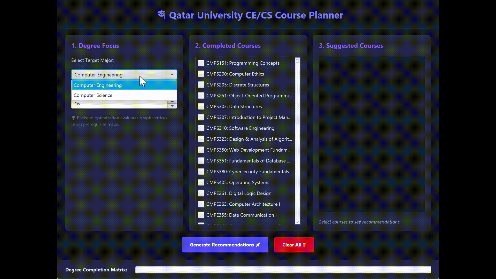

# 🎓 Qatar University CE/CS Course Planner


> A course planner for QU engineering students (CE/CS), handling prerequisite validation and corequisite bundling for multi-major curriculum planning.

### 🚀 Project Overview
The **Qatar University (QU) CE/CS Course Planner** is a JavaFX application designed to assist QU engineering students in planning their academic semesters. It models course dependencies—prerequisites and corequisites—to generate semester-based course recommendations for **Computer Engineering (CE)** and **Computer Science (CS)** majors.

The application evaluates a student's completed courses and a desired credit limit to suggest a valid set of courses, ensuring that all interdependent corequisites are bundled together in the recommendation.

---

### 🔑 Key Features & Functions
*   **Prerequisite Validation**: Automatically checks student course history against degree requirements to ensure a course is only recommended once all of its dependent prerequisites are completed.
*   **Corequisite Chain Resolution**: Links dependent co-requisite courses, ensuring they are scheduled concurrently within the same semester without violating the user's maximum credit limit or prerequisite rules.
*   **Degree Progress Tracking**: Computes and visually displays real-time degree completion metrics based on completed credit hours against total program requirements.
*   **Major-Specific Filtering**: Tailors course recommendations dynamically based on the student's selected academic track (Computer Engineering or Computer Science).
---

### 📸 Application Preview

 

---

### ⚙️ Prerequisites & Installation

#### System Requirements
*   **JDK 25**: The project is configured to target Java 25 (`<source>25</source>`, `<target>25</target>`).
*   **Maven 3.8+**: Used for build automation and dependency management.

#### Dependencies (Managed via Maven)
*   **JavaFX (Controls & FXML)**: Core UI framework.
*   **ControlsFX**: Used for advanced UI components.
*   **ValidatorFX**: Provides input validation utilities.
*   **JUnit 5**: Testing framework for unit and integration tests.

#### Installation & Quick Start
1. Clone the repository.
2. Ensure `JAVA_HOME` points to a JDK 25 installation.
3. Install dependencies and build the project:
   ```powershell
   mvn clean install
   ```

---

### 🏃 Usage Examples

#### Running the Application
The application can be launched using the JavaFX Maven plugin (recommended):
```powershell
mvn javafx:run
```
Alternatively, execute the `com.example.smartcourseplanner.Launcher` class.

#### Interaction Steps
1.  **Select Target Major**: Choose "Computer Engineering" or "Computer Science" from the dropdown.
2.  **Set Desired Credit Hours**: Use the spinner (12–21 credits) to define the maximum workload.
3.  **Mark Completed Courses**: Select courses from the checklist in the middle column.
4.  **Generate**: Click **"Generate Recommendations 🚀"**.
5.  **Review**: Valid course recommendations will appear in the "Suggested Courses" column.

---

### 🏛️ Architecture & Component Design
The system is structured into three primary layers:

#### 1. Domain Model (`com.example.smartcourseplanner`)
Acts as the single source of truth for catalog data. A centralized enumeration (`CourseIDs`) maintains course metadata (credits, classifications, major requirements), preventing state inconsistency across the app. Dynamic wrapper nodes encapsulate runtime prerequisite and co-requisite dependencies.

#### 2. Planning Engine (`CoursePlanner`)
Encapsulates course-selection logic independently of the UI layer, improving testability and maintainability. Utilizes an in-memory `Hash Map` for $O(1)$ course lookups and a stack-based **Depth-First Search (DFS)** to resolve co-requisite chains as atomic bundles. Eligible courses are prioritized using the following order: 

Core $\rightarrow$ College Requirements $\rightarrow$ Electives.

#### 3. Presentation Layer (`SmartPlannerUI`)
A JavaFX dashboard that captures user state (target major, credit limits, completed coursework). It communicates with the planning engine without containing the underlying selection logic, allowing the engine to be reused across other interfaces, such as a CLI or web frontend.

Data Flow:

`UI State Capture` → `Engine Graph Evaluation` → `Priority-Based Filtering` → `Dashboard Rendering`

---

### 📂 Project Structure
```text
src/
├── main/
│   ├── java/
│   │   ├── com.example.smartcourseplanner/
│   │   │   ├── Course.java              # Course relationship wrapper
│   │   │   ├── CourseIDs.java           # Central course catalog (Enum)
│   │   │   ├── CoursePlanner.java       # Recommendation engine & algorithms
│   │   │   ├── CourseType.java          # CORE, COLLEGE_REQUIREMENT, ELECTIVE
│   │   │   ├── HelloApplication.java    # JavaFX entry point
│   │   │   ├── HelloController.java     # FXML controller point
│   │   │   ├── Launcher.java            # Main entry point for JAR/IDE
│   │   │   ├── Majors.java              # Major definitions (CE, CS)
│   │   │   └── SmartPlannerUI.java      # Primary UI and graph initialization
│   │   └── module-info.java             # Java Module System configuration
│   └── resources/
│       └── com.example.smartcourseplanner/
│           └── hello-view.fxml          # FXML layout (unused by SmartPlannerUI)
└── pom.xml                              # Maven build and dependency config
```

---

### ⚠️ Limitations
*   **Course Availability**: Does not account for which semesters (Fall/Spring) specific courses are offered.
*   **Scheduling Conflicts**: Does not check for overlapping class times or timetable constraints.
*   **Global Optimization**: Generates a valid plan for the *next* semester only; it does not calculate the shortest path to graduation across multiple future semesters.
*   **External Integration**: Operates as a standalone tool and does not sync with university registration or student record systems.

---

### 🧪 Testing & Future Enhancements

#### Testing
Currently, the repository does not contain automated test suites (e.g., JUnit). All verification has been performed through manual UI testing of the recommendation logic. For future contributors, the project is configured for **JUnit 5**, and tests can be executed using:
```powershell
mvn test
```

#### Future Roadmap
*   **Semester Availability Filter**: Integrate logic to distinguish between Fall, Spring, and Summer course offerings.
*   **Conflict Detection**: Implement a timetable validator to check for overlapping time slots between recommended courses.
*   **Multi-Semester Pathing**: Extend the engine to generate a multi-semester graduation path rather than a single-semester recommendation.

---

### 📜 License
No explicit license is provided for this project.
